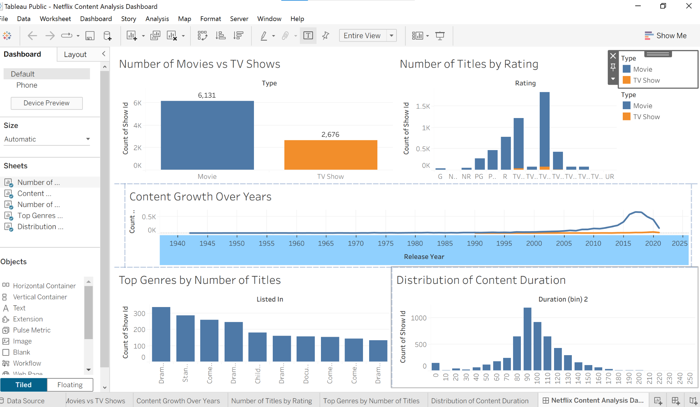

## Netflix Content Analysis Dashboard
# Project Overvie
This project analyzes the Netflix Titles dataset to understand the content available on Netflix. The analysis looks at movies, TV shows, genres, ratings, release years, and countries. The data was cleaned and analyzed using Python, and the dashboard was created in Tableau.

# Dashboard Preview
Netflix Dashboard

# Project Objective
The goal of this project is to find useful insights from Netflix's content library. This dashboard helps users understand how Netflix content has changed over the years and what types of content are most common.

# Business Questions
How has Netflix content changed over the years?
What is the difference between Movies and TV Shows?
Which countries have the most Netflix content?
What are the most common genres?
How has content production changed over time?
What are the most common content ratings?
# Dataset Description
This project uses the Netflix Titles dataset. The dataset includes information about movies and TV shows available on Netflix.

# The dataset contains:

# Title
Type (Movie or TV Show)
Country
Release Year
Rating
Genre
Duration
Tools Used
Python
Pandas
NumPy
Tableau
Data Cleaning
Data Visualization
Analysis Steps
Loaded the dataset into Python.
Checked the data for missing values and duplicates.
Cleaned the data.
Explored the data using Python.
Created charts and graphs in Tableau.
Built an interactive dashboard.
Found key insights from the data.
# Dashboard Features
# The dashboard includes:

Movies vs TV Shows
Content by country
Content by release year
Genre distribution
Ratings distribution
Interactive filters
# Key Analysis
# The dashboard shows:

Distribution of Movies and TV Shows
Top countries producing Netflix content
Content growth over the years
Most common genres
Ratings of Netflix content
# Key Insights
Netflix has added more content over the years.
Movies make up a larger part of the Netflix library than TV Shows.
The United States has the highest number of titles.
Drama and International Movies are some of the most common genres.
Most Netflix content is rated TV-MA and TV-14.
# Business Recommendations
Continue adding popular movie genres.
Increase content from more countries.
Add more TV Shows to attract different viewers.
Keep a good mix of content for different age groups.
# Skills Demonstrated
Data Cleaning
Exploratory Data Analysis (EDA)
Data Visualization
Tableau Dashboard
Python (Pandas and NumPy)
Finding business insights
# Future Improvements
# In the future, I would like to:

Add more visualizations.
Compare Netflix content with other streaming platforms.
Build the same dashboard in Power BI.
Add more advanced analysis using Python.
# Folder Structure
netflix-content-analysis/
│
├── Netflix Content Analysis Dashboard.twbx
├── netflix_titles.csv
├── netflix-dashboard.png
└── README.md
# Conclusion
This project helped me improve my Python, Tableau, and data analysis skills. It also helped me learn how to clean data, create dashboards, and find useful insights from real-world data.

# Dataset Source
Netflix Titles Dataset from Kaggle:

https://www.kaggle.com/datasets/shivamb/netflix-shows
